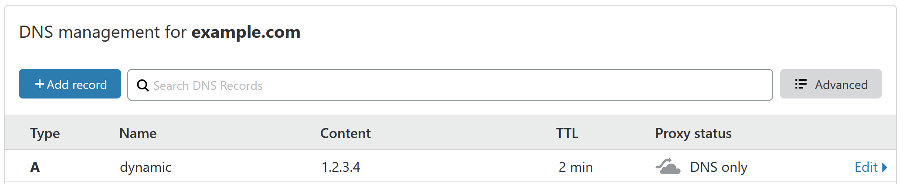

# cloudflare-dyndns

A simple shell script to update a single DNS record on cloudflare according to your own current IP address.

Use as a replacement for one of the dynamic DNS services.

## Dependencies

* `bash`
* `dig` (part of `dnsutils`)
* `curl`
* `jq`

**Note:** This script uses the ipify.com API to determine your current IP address. If you have privacy concerns about that, other ways of finding your IP are possible. Pull requests welcome!

## Setup

Enable a domain on cloudflare, and add an `A Record` for the host you want to use:

Copy `.env.production.example` to `.env.production` and edit the settings to match your domain. Create an auth token with cloudflare that includes the scope: Edit Zone DNS.

Run `./update-ip.sh`, which will check your current public IP and compare it to the DNS record in question, updating it with cloudflare if necessary.

Party time.
